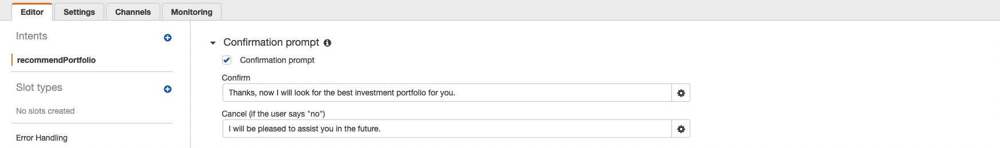

# Retirement Advisor Bot
Using AMAZON WEB SERVICES (AWS) to create a robo advisor that will engage and recommend an investment portfolio for a retirement plan based on a serie of questions.

----------

## AMAZON LEX | Configuration
AMAZON LEX was chosen as a solution for the Conversational User Interface (CUI). 

1. Initialized the configuration using several **Sample Utterances** as show below:

2. Second step was to configure the **Slots** in order to define the questions and type of data expected as a reply from the users.

3. And finaly, the final step of the initial configuration was to setup the **confirmation** dialogue.

----------

## AMAZON LEX | Configuration Testing
Following the confirguration, a first pass of testing was completed to confirm the configuration process was completed succesfully.

https://user-images.githubusercontent.com/35586344/179370792-3e6c1969-1c7f-4d34-b233-2fcb04128f86.mp4

----------

## AMAZON LAMBDA | Lambda Function

The AMAZON LAMBDA function was added to the AMAZON LEX configuration to validate some of the user data inputs:
- Age
- Investment amount

The function also returns investment recommendation which are triggered once the intent is fulfilled.

----------

## AMAZON LEX | Final Testing
Following the integration of the lambda function, a final pass of testing was completed to confirm the robot advisor was working as expected.

https://user-images.githubusercontent.com/35586344/179373121-93f6259f-c2dd-498c-b907-d7a5aa5754be.mp4

----------

## Contributors

This application originated from a Berkeley Bootcamp.

For any inquieries, feedbacks or comments about this project please email me at  [yanickw@gmail.com](mailto:yanickw@gmail.com)

I can also be reached on  [LinkedIn](https://www.linkedin.com/in/yanickwilisky/)  or  [Twitter](https://twitter.com/yanickwilisky).

----------

## License

MIT License

Copyright (c) 2022 Yanick Wilisky

Permission is hereby granted, free of charge, to any person obtaining a copy of this software and associated documentation files (the "Software"), to deal in the Software without restriction, including without limitation the rights to use, copy, modify, merge, publish, distribute, sublicense, and/or sell copies of the Software, and to permit persons to whom the Software is furnished to do so, subject to the following conditions:

The above copyright notice and this permission notice shall be included in all copies or substantial portions of the Software.

THE SOFTWARE IS PROVIDED "AS IS", WITHOUT WARRANTY OF ANY KIND, EXPRESS OR IMPLIED, INCLUDING BUT NOT LIMITED TO THE WARRANTIES OF MERCHANTABILITY, FITNESS FOR A PARTICULAR PURPOSE AND NONINFRINGEMENT. IN NO EVENT SHALL THE AUTHORS OR COPYRIGHT HOLDERS BE LIABLE FOR ANY CLAIM, DAMAGES OR OTHER LIABILITY, WHETHER IN AN ACTION OF CONTRACT, TORT OR OTHERWISE, ARISING FROM, OUT OF OR IN CONNECTION WITH THE SOFTWARE OR THE USE OR OTHER DEALINGS IN THE SOFTWARE.

